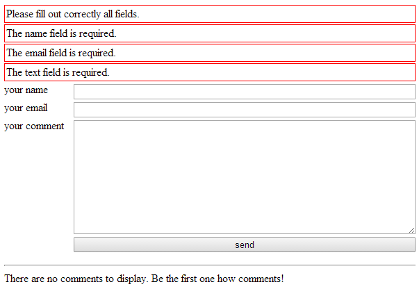

# Laravel commentary

A package for Laravel to post a comment on an article and to manage them.

## Description

This package comes with 3 parts:

* comment form
* comment listing
* comment management

The form allows anyone to post a comment on something. It can be applied to any view. The same goes for ther comment listing. 

The comment management allows someone to

* approve
* unapprove
* edit
* trash

comments.

## Screenshots

### Form



### Management


## Implementation

### ServiceProvider

``'Alexwenzel\LaravelCommentary\LaravelCommentaryServiceProvider'``

### Namespace

The package registers the following namespace: ``laravel-commentary``

### Migration

````
php artisan migrate --package="alexwenzel/laravel-commentary"
````

The migration creates a table named: ``laravel-commentary-comments``

### Comment controllers

There is a controller to manage the comments, and there is a controller for the frontend stuff. The management controller is best behind a secured route.

Include something like the following line in your ``routes.php``:

````php
/**
 * Comment Management
 */
Route::controller('commentsmanagement', 'Alexwenzel\LaravelCommentary\ManagementController');

/**
 * Comment Frontend
 */
Route::controller('commentsfrontend', 'Alexwenzel\LaravelCommentary\FrontendController');
````

If you need to customize the management section, override the view within your project.

### Comment form

To display the comment form, include something like the following line in your view:

````php
{{ View::make('laravel-commentary::comment-form', array('entity'=>'my_article_id')) }}
````

Register the controller first, otherwise you will get errors.

### Comment listing

To display the comments of an entity, include something like the following line in your view:

````php
{{ View::make('laravel-commentary::comment-list', array('entity'=>'my_article_id')) }}
````

Register the controller first, otherwise you will get errors.

The following conditions are applied to the comment listing. Comments:

* have to be approved
* are ordered by creation time

### Comment controller behaviour

The behaviour can be customized by overriding ``CommentaryActionHandler`` class.

### Assets

This package comes with default styles.

````
php artisan asset:publish alexwenzel/laravel-commentary
````